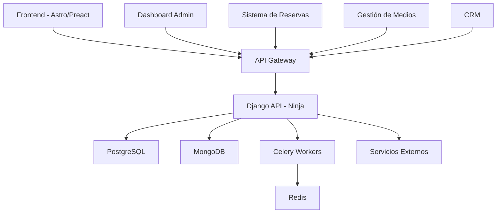

# Arquitectura del Sistema - Condor Expeditions

## Visión General

Plataforma integral de turismo para Condor Expeditions que incluye ecommerce, gestión de tours, reservas, comunidades y servicios adicionales. Arquitectura modular diseñada para expansión futura hacia un marketplace.

## Stack Tecnológico

### Frontend
- **Astro**: Framework principal para páginas estáticas y generación de sitios
- **Preact**: Para componentes interactivos y alta performance
- **pnpm**: Gestor de paquetes para desarrollo frontend

### Backend
- **Django**: Framework web principal
- **Django Ninja**: Para APIs REST modernas y tipadas
- **uv**: Gestor de paquetes Python de alta velocidad

### Bases de Datos
- **SQLite**: Desarrollo y testing
- **PostgreSQL**: Base de datos relacional principal (producción)
- **MongoDB**: Base de datos NoSQL para contenido dinámico y medios

### Herramientas Adicionales
- **Celery**: Procesamiento de tareas asíncronas
- **Redis**: Broker de mensajes para Celery
- **Docker**: Containerización y despliegue

## Arquitectura del Sistema



## Estructura de Bases de Datos

### PostgreSQL (Datos Relacionales)

#### Usuarios y Autenticación
- `users` - Perfiles de usuario
- `user_profiles` - Información adicional del usuario
- `user_preferences` - Preferencias y configuración

#### Gestión de Tours y Servicios
- `tours` - Tours y expediciones principales
- `tour_schedules` - Horarios y disponibilidad
- `tour_inventory` - Control de cupos y recursos
- `services` - Servicios adicionales (fotografía, drone, etc.)
- `packages` - Paquetes completos (alojamiento, comida, transporte)

#### Reservas y Comercio
- `reservations` - Sistema de reservas
- `reservation_items` - Items dentro de cada reserva
- `payments` - Información de pagos
- `payment_transactions` - Transacciones de pago

#### Gestión Interna
- `staff` - Personal de la empresa
- `staff_roles` - Roles y permisos
- `communities` - Comunidades asociadas
- `community_services` - Servicios ofrecidos por comunidades

### MongoDB (Contenido Dinámico)

#### Gestión de Medios
- `media_albums` - Álbumes de fotos y videos
- `media_360` - Contenido 360°
- `media_metadata` - Metadatos de medios

#### Redes Sociales y Marketing
- `social_posts` - Publicaciones en redes sociales
- `social_schedules` - Programación de publicaciones
- `marketing_campaigns` - Campañas de marketing

## APIs Principales

### API de Reservas
- `GET/POST /api/v1/reservations` - Gestión de reservas
- `GET /api/v1/availability` - Consulta de disponibilidad
- `POST /api/v1/booking` - Proceso de reserva

### API de Tours
- `GET /api/v1/tours` - Listado de tours
- `GET /api/v1/tours/{id}` - Detalle de tour específico
- `GET /api/v1/tours/search` - Búsqueda y filtros

### API de Medios
- `GET /api/v1/media/albums` - Álbumes públicos
- `POST /api/v1/media/upload` - Subida de medios (autenticado)
- `GET /api/v1/media/360/{id}` - Contenido 360°

### API de Comunidades
- `GET /api/v1/communities` - Comunidades asociadas
- `GET /api/v1/communities/{id}/services` - Servicios comunitarios

## Arquitectura Frontend

### Estructura de Páginas (Astro)
```
src/
├── pages/
│   ├── index.astro          # Página principal
│   ├── tours.astro          # Listado de tours
│   ├── tour/[id].astro      # Detalle de tour
│   ├── booking.astro        # Proceso de reserva
│   ├── gallery.astro        # Galería de medios
│   ├── communities.astro    # Comunidades
│   ├── profile.astro        # Perfil de usuario
│   └── admin/
│       └── dashboard.astro  # Dashboard administrativo
├── components/              # Componentes Preact
│   ├── TourCard.tsx
│   ├── BookingForm.tsx
│   ├── MediaGallery.tsx
│   ├── Calendar.tsx
│   └── PaymentForm.tsx
└── layouts/
    ├── BaseLayout.astro
    └── AdminLayout.astro
```

## Servicios Externos e Integraciones

### Pasarelas de Pago
- Stripe
- PayPal
- MercadoPago (para Latinoamérica)

### Servicios de Mapas y Ubicación
- Google Maps API
- OpenStreetMap (alternativa gratuita)

### Servicios de Comunicación
- Email: SendGrid o Amazon SES
- SMS: Twilio o servicios locales
- Push Notifications: Firebase Cloud Messaging

### Almacenamiento de Medios
- Amazon S3 o CloudFlare R2 para imágenes/videos
- CloudFront para distribución de contenido

## Seguridad

### Autenticación
- JWT tokens para API
- OAuth2 para redes sociales
- Autenticación de dos factores (opcional)

### Autorización
- Roles: Admin, Staff, Community, User
- Permisos granulares por módulo
- Auditoría de acciones importantes

## Despliegue y DevOps

### Entornos
- **Desarrollo**: Docker Compose con SQLite
- **Staging**: Servidores dedicados con PostgreSQL
- **Producción**: Kubernetes o Docker Swarm

### Configuración Docker
```dockerfile
# Multi-etapa para optimización
FROM python:3.11-slim as backend-builder
FROM node:18-alpine as frontend-builder

# Imagen final
FROM python:3.11-slim
COPY --from=backend-builder /app/backend /app/backend
COPY --from=frontend-builder /app/frontend/dist /app/frontend
```

## Monitorización y Logs

### Métricas
- Prometheus para métricas del sistema
- Grafana para dashboards
- Sentry para manejo de errores

### Logs
- ELK Stack (Elasticsearch, Logstash, Kibana)
- Logs estructurados con niveles apropiados

## Marketplace Modular

### Arquitectura Plugin
```typescript
interface PluginInterface {
  name: string;
  version: string;
  install(): Promise<void>;
  uninstall(): Promise<void>;
  getServices(): Service[];
}

class MarketplaceManager {
  async installPlugin(plugin: PluginInterface) {
    // Lógica de instalación
  }
}
```

### Tipos de Plugins
- Proveedores de pago adicionales
- Integraciones con OTAs
- Herramientas de marketing
- Servicios de comunicación

## Próximos Pasos

1. **Configuración inicial del proyecto**
2. **Diseño detallado de la base de datos**
3. **Implementación del núcleo de la API**
4. **Desarrollo del sistema de autenticación**
5. **Creación del frontend básico**

¿Estás de acuerdo con esta arquitectura? ¿Te gustaría que ajuste algún aspecto específico?